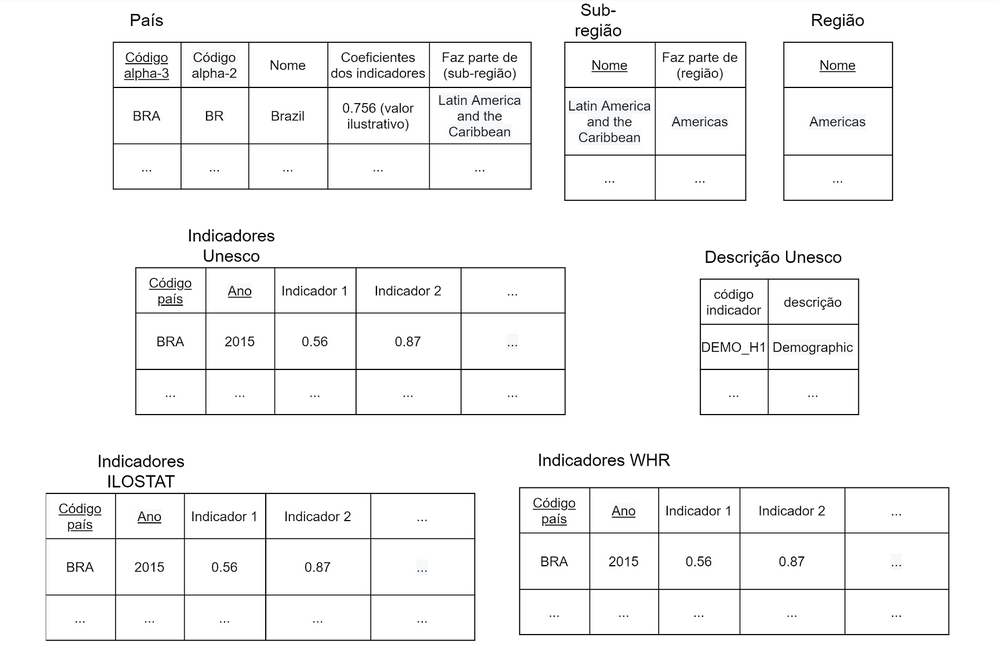
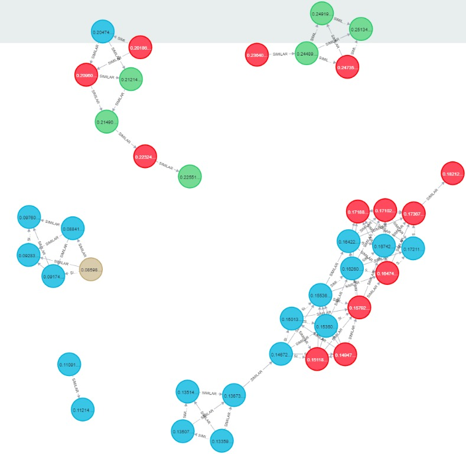

# Etapa Final

## Slides da Apresentação da Etapa
[Slides](./slides/apresentacao_final.pdf)

## Motivação e Contexto
- Depois da própria COVID-19, saúde mental está sendo um tópico bem quente para
a medicina.

- Queremos entender melhor o cenário global da área

- Que fatores estão correlacionados com a saúde mental?

- Que aspectos podem ou não prejudicar a saúde das pessoas?

- O que os países felizes têm em comum?

- O que podemos aprender com esses lugares?

## Análise 1
- Que fatores estão associados com a felicidade de um povo?

- Iremos verificar que indicadores estão associados a índices de fecilicide mais elevados.

- Para isso podemos comparar a proporção de países felizes com a proporção de países felizes com determinada característa.

- Fazer o cálculo de correlação entre os indicadores pode ser interessante.

- Entre os indicadores temos indicadores socioeconômicos, relacionados a trabalho e felicidade de um país.

## Análise 2
- Tendo indicadores associados a maiores índices de felicidade, iremos tentar agrupar os países similares.

- Para isso, será definida uma função F(I), sendo I os indicadores do país.

- Dois países serão similares se tiverem F(I) próximos.

- A função F irá definir o "fator de semelhança" de cada país.

- Tendo os países similares, é possível contruir e visualizar um grafo dos países, coloridos de acordo com sua felicidade. 

  F(I) é definida como:
  


  Sendo corr(i,f) a correlação do índice i e a pontuação de felicidade da base de dados World Happiness Report, e vi, o valor o indicador i.

  A correlação é definida como:
  


## Modelo conceitual


## Modelo lógico

### Relacional



### Grafos

```
(:country {codigo, nome, pontuacao_felicidade, indice_semelhanca*})-[:similar]-(:country)

sendo similar se houver intersecção entre os valores de uma vizinhança dos indice_semelhanca's de ambos os países.

*da função F definida acima
```


## Programa de extração e conversão de dados atualizado

[Notebook com queries para preparar a ILOSTAT](./notebooks/prepareILOSTAT.ipynb)

[Notebook que processa em python os dados Unesco](./notebooks/unesco.ipynb)

[Notebook que processa em SQL os dados Unesco, WHR e código de países](./notebooks/unesco_WHR_SQL.ipynb)


## Conjunto de queries de dois modelos

[Notebook com as queries em SQL](./notebooks/make_db.ipynb)

[Arquivo em markdown com queries do Cypher](./notebooks/cypher_playground.md)

## Visualização

[Projeto Gephi para visualizar comunidades](./src)


## Bases de Dados

| Título da base | Link | Descrição |
| -- | -- | -- |
| World Happiness Report| [link](https://kaggle.com/unsdsn/world-happiness) | Dados sobre a felicidade dos países |
| ILOSTAT| [link](https://ilostat.ilo.org/data/) | Dados sobre condições de trabalho |
| Countries with Regional Codes | [link](https://github.com/lukes/ISO-3166-Countries-with-Regional-Codes/blob/master/all/all.csv) | Lista de países, códigos e suas regiões |
| Demographic and socio-economic | [link](http://data.uis.unesco.org/Index.aspx?DataSetCode=DEMO_DS#) | Dados socio econômicos dos países |

## Arquivos de Dados

### Arquivos não processados

| nome do arquivo | link | breve descrição |
| -- | -- | -- |
| country_code.csv | [link](./data/raw/countries/country_atualizado.csv) | nome, código e região dos países |
| poverty_age15plus.csv | [link](./data/raw/ilostat/ILOSTAT_CHRIS/poverty_age15plus.csv) | Índice de pobreza dos países |
| unemployment_age15to64.csv | [link](./data/raw/ilostat/ILOSTAT_CHRIS/unemployment_age15to64.csv) | Índice de desemprego dos países |
| unesco_socio_economics.xml | [link](./data/raw/unesco/unesco_socio_economics.xml) | XML com indicadores diversos dos países |
| \<ano\>.csv | [link](./data/raw/WHR) | Série de arquivos csv da World Happiness Report |

### Arquivos processados de acordo com modelo lógico

| nome do arquivo | link | breve descrição |
| -- | -- | -- |
| countries.csv | [link](./data/processed/countries_processed/countries.csv) | tabela país do modelo lógico |
| regions.csv | [link](./data/processed/countries_processed/regions.csv) | tabela de regiões do modelo lógico |
| subregions.csv | [link](./data/processed/countries_processed/subregions.csv) | tabela de subregiões do modelo lógico |
| ilostat_processed.csv | [link](./data/processed/ilostat/ilostat_processed.csv) | tabela da ILOSTAT do modelo lógico |
| whr_processadp.csv | [link](./data/processed/whr/whr_processado.csv) | tabela da WHR do modelo lógico |
| unesco_processed_data | [link](./data/processed/unesco/unesco_processed_data) | tabela da WHR do modelo lógico |
| arquivos para o Cypher | [link](./data/processed/cypher) | arquivos csv para serem carregados no Cypher |
| arquivos para o Gephi | [link](./data/processed/gephi) | arquivos csv para serem carregados no Gephi |

## Grafo de regiões, sub-regiões e países

### Grafo de regiões, sub-regiões e países

Aqui os países foram ligados às sub-regiões que pertencem, e as subregiões foram ligadas às regiões. Além disso, os países (folhas) foram coloridos de acordo com seu índice de felicidade.


<ul>
  <li> Os países são as folhas </li>
  <li> Verde: índice de felicidade ≥ 0,75 </li>  
  <li> Vermelho: 0,75 > índice ≥ 0,5 </li>  
  <li> Azul claro: 0,25 ≥ índice > 0,5 </li>  
  <li> Bege: índice < 0,25 </li>  
  <li> Laranja: sem dados </li>  
</ul>

Através da visualização do grafo, não foi possível notar um padrão claro na distribuição dos países mais felizes, portanto, essa linha de reciocínio foi abandonada, em favor da análise através do fator de semelhança descrito acima.

### Grafo de semelhança visualizado no Cypher



<ul>
  <li> Verde: índice de felicidade ≥ 0,75 </li>  
  <li> Vermelho: 0,75 > índice ≥ 0,5 </li>  
  <li> Azul claro: 0,25 ≥ índice > 0,5 </li>  
  <li> Bege: índice < 0,25 </li>  
  <li> Número no vértice: fator de semelhança </li>  
</ul>

Esse grafo é interessante pois os países de mesma cor (índice de felicidade próximos) parecem estar formando grupos, para investigar melhor isso, o Algoritmo de Louvain foi utilizado para encontrar comunidades, gerando a próxima visualização. 

### Visualização de comunidades com o Gephi


<ul>
  <li> Cada cor é uma comunidade. </li>
  <li> O tamanho do nó é proporcional ao seu índice de felicidade </li>  
</ul>

Apesar de não ser absoluto, é possível perceber que países de uma mesma comunidade (cor) têm índices de felicidade

## Conclusão

<ul>
  <li> A partir do grafo de semelhança construído foi possível perceber que países na mesma comunidade de semelhança possuíam níveis próximos de felicidade. </li>
  <li>Desta forma, este valor que criamos poderia ser usado como um possível indicador indireto da felicidade de um país. No entanto não existe um conjunto de testes para comprovar esta hipótese. </li>
  <li> Todos os países com dados conhecidos foram utilizados para gerar o modelo (fator de semelhança), porém não existe um conjunto separado de dados para avaliar o seu desempenho de maneira apropriada. </li>
  <li> Também é possível perceber com base no grafo de localização geográfica que estas comunidades não possuem relação alguma com a localização de um país, apenas, provavelmente, com seus fatores socioeconômicos, que foi o que utilizamos em nossa análise. Por exemplo, Brasil, Belarus, Malásia, Costa Rica, México e Panamá estão numa mesma comunidade </li>  
  <li> Um fato importante a se destacar é que o índice de felicidade do World Happiness Report é um resultado subjetivo que depende basicamente da percepção de uma amostra da população de um país sobre sua própria felicidade, então muitos outros fatores baseados em outras evidências empíricas foram deixadas de fora de nossa análise que poderiam alterar alguns de nossos resultados, no entanto, isso não invalida os resultados interessantes que foram produzidos em nossa análise. </li>
</ul>
