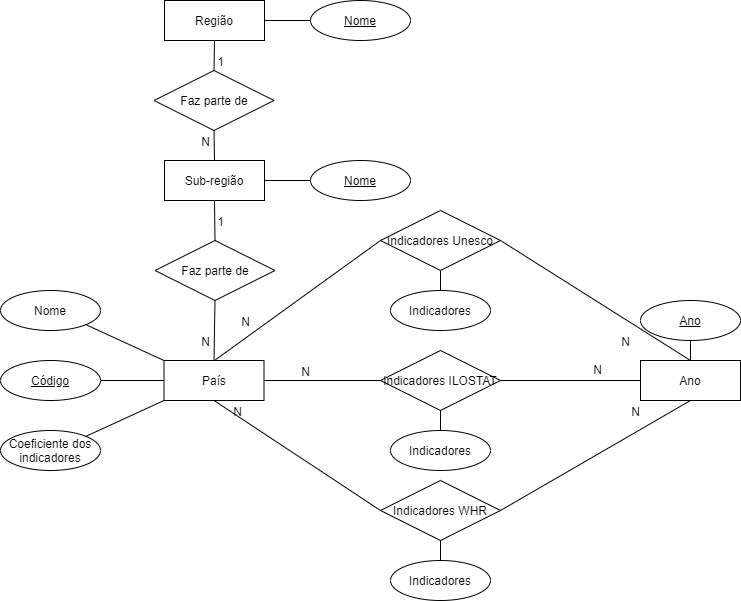
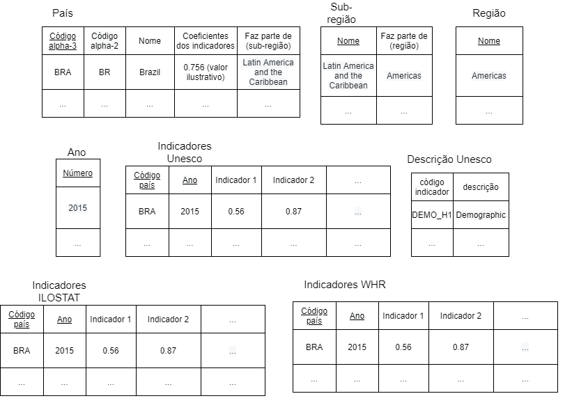

Etapa 3 - Primeiros Modelos e Análises

## Motivação e Contexto
- Depois da própria COVID-19, saúde mental está sendo um tópico bem quente para
a medicina.

- Queremos entender melhor o cenário global da área

- Que fatores estão correlacionados com a saúde mental?

- Que aspectos podem ou não prejudicar a saúde das pessoas?

- O que os países felizes têm em comum?

- O que podemos aprender com esses lugares?

## Análise 1
- Que fatores estão associados com a felicidade de um povo?

- Iremos verificar que indicadores estão associados a índices de fecilicide mais elevados.

- Para isso podemso comparar a proporção de países felizes com a proporção de países felizes com determinada característa.

- Fazer o cálculo de correlação entre os indicadores pode ser interessante.

- Entre os indicadores temos indicadores socioeconômicos, relacionados a trabalho e felicidade de um país.

## Análise 2
- Tendo indicadores associados a maiores índices de felicidade, iremos tentar agrupar os países similares.

- Para isso, será definida uma função F(I), sendo I os indicadores do país.

- Dois países serão similares se tiverem F(I) próximos.

- Tendo os países similares, é possível contruir e visualizar um grafo dos países, coloridos de acordo com sua felicidade.

## Bases de Dados

| Título da base | Link | Descrição |
| -- | -- | -- |
| World Happiness Report| [link](https://kaggle.com/unsdsn/world-happiness) | Dados sobre a felicidade dos países |
| ILOSTAT| [link](https://ilostat.ilo.org/data/) | Dados sobre condições de trabalho |
| Countries with Regional Codes | [link](https://github.com/lukes/ISO-3166-Countries-with-Regional-Codes/blob/master/all/all.csv) | Lista de países, códigos e suas regiões |
| Demographic and socio-economic | [link](http://data.uis.unesco.org/Index.aspx?DataSetCode=DEMO_DS#) | Dados socio econômicos dos países |

## Modelo conceitual

## Modelo lógico

## Notebook
