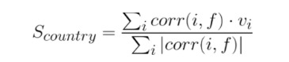
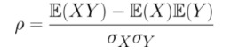
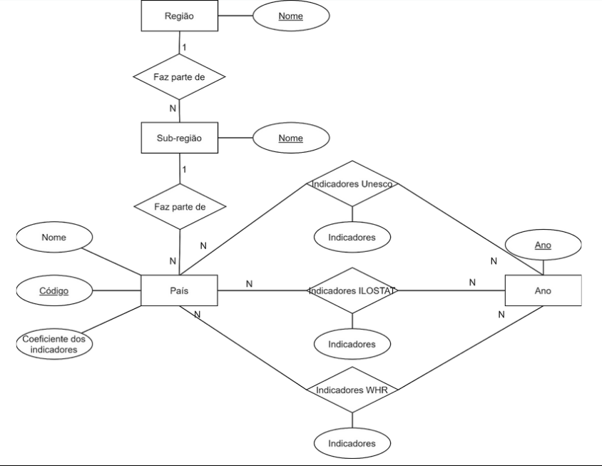
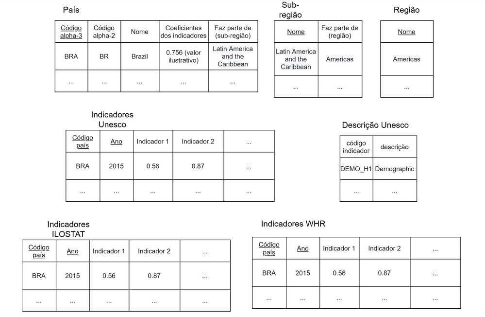

# Etapa 04 - Análises com o Segundo Modelo Lógico


## Motivação e Contexto
- Depois da própria COVID-19, saúde mental está sendo um tópico bem quente para
a medicina.

- Queremos entender melhor o cenário global da área

- Que fatores estão correlacionados com a saúde mental?

- Que aspectos podem ou não prejudicar a saúde das pessoas?

- O que os países felizes têm em comum?

- O que podemos aprender com esses lugares?

## Análise 1
- Que fatores estão associados com a felicidade de um povo?

- Iremos verificar que indicadores estão associados a índices de fecilicide mais elevados.

- Para isso podemos comparar a proporção de países felizes com a proporção de países felizes com determinada característa.

- Fazer o cálculo de correlação entre os indicadores pode ser interessante.

- Entre os indicadores temos indicadores socioeconômicos, relacionados a trabalho e felicidade de um país.

## Análise 2
- Tendo indicadores associados a maiores índices de felicidade, iremos tentar agrupar os países similares.

- Para isso, será definida uma função F(I), sendo I os indicadores do país.

- Dois países serão similares se tiverem F(I) próximos.

- Tendo os países similares, é possível contruir e visualizar um grafo dos países, coloridos de acordo com sua felicidade. 

  F(I) é definida como:
  


  Sendo corr(i,f) a correlação do índice i e a pontuação de felicidade da base de dados World Happiness Report, e vi, o valor o indicador i.

  A correlação é definida como:
  



## Modelo conceitual



## Modelo lógico

### Relacional



### Grafos

```
(:country {codigo, nome, pontuacao_felicidade, indice_semelhanca*})-[:similar]-(:country)

sendo similar se houver intersecção entre os valores de uma vizinhança dos indice_semelhanca's de ambos os países.

*da função F definida acima
```


## Programa de extração e conversão de dados atualizado

[Notebook com queries para preparar a ILOSTAT](./notebooks/prepareILOSTAT.ipynb)

[Notebook que processa em python os dados Unesco](./notebooks/unesco.ipynb)

[Notebook que processa em SQL os dados Unesco e WHR](./notebooks/unesco_WHR_SQL.ipynb)


## Conjunto de queries de dois modelos

[Notebook com as queries em SQL](./notebooks/make_db.ipynb)

[Arquivo em markdown com queries do Cypher](./notebooks/cypher_playground.md)


## Bases de Dados

| Título da base | Link | Descrição |
| -- | -- | -- |
| World Happiness Report| [link](https://kaggle.com/unsdsn/world-happiness) | Dados sobre a felicidade dos países |
| ILOSTAT| [link](https://ilostat.ilo.org/data/) | Dados sobre condições de trabalho |
| Countries with Regional Codes | [link](https://github.com/lukes/ISO-3166-Countries-with-Regional-Codes/blob/master/all/all.csv) | Lista de países, códigos e suas regiões |
| Demographic and socio-economic | [link](http://data.uis.unesco.org/Index.aspx?DataSetCode=DEMO_DS#) | Dados socio econômicos dos países |

## Arquivos de Dados

### Arquivos não processados

| nome do arquivo | link | breve descrição |
| -- | -- | -- |
| country_code.csv | [link](./data/raw/countries/country_atualizado.csv) | nome, código e região dos países |
| poverty_age15plus.csv | [link](./data/raw/ilostat/ILOSTAT_CHRIS/poverty_age15plus.csv) | Índice de pobreza dos países |
| unemployment_age15to64.csv | [link](./data/raw/ilostat/ILOSTAT_CHRIS/unemployment_age15to64.csv) | Índice de desemprego dos países |
| unesco_socio_economics.xml | [link](./data/raw/unesco/unesco_socio_economics.xml) | XML com indicadores diversos dos países |
| \<ano\>.csv | [link](./data/raw/WHR) | Série de arquivos csv da World Happiness Report |

### Arquivos processados de acordo com modelo lógico

| nome do arquivo | link | breve descrição |
| -- | -- | -- |
| countries.csv | [link](./data/processed/countries_processed/countries.csv) | tabela país do modelo lógico |
| regions.csv | [link](./data/processed/countries_processed/regions.csv) | tabela de regiões do modelo lógico |
| subregions.csv | [link](./data/processed/countries_processed/subregions.csv) | tabela de subregiões do modelo lógico |
| ilostat_processed.csv | [link](./data/processed/ilostat/ilostat_processed.csv) | tabela da ILOSTAT do modelo lógico |
| whr_processadp.csv | [link](./data/processed/whr/whr_processado.csv) | tabela da WHR do modelo lógico |
| unesco_processed_data | [link](./data/processed/unesco/unesco_processed_data) | tabela da WHR do modelo lógico |
