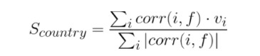
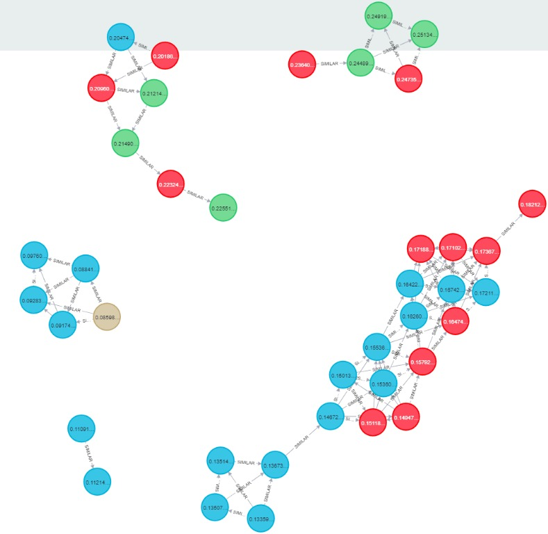
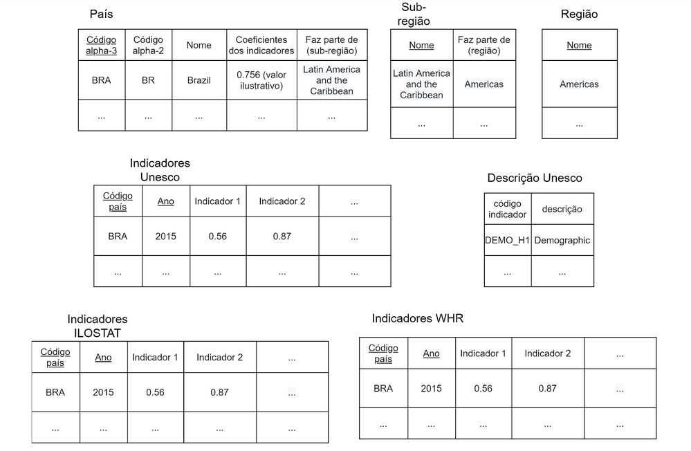
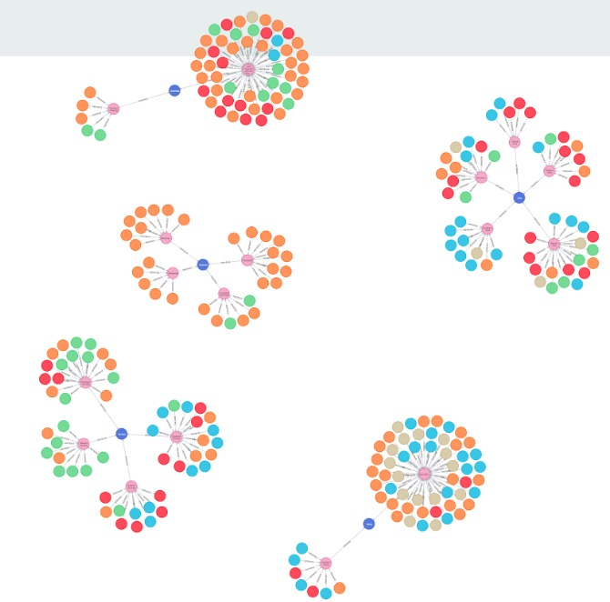

# Etapa Final

## Projeto Felicidade: fatores socioeconômicos

## Equipe PsycHealth
- Christian Massao Konishi, 214570
- Gabriel de Freitas Garcia, 216179
- Andrey Torres de Lima, 231442

## Slides da Apresentação da Etapa
[Slides](./slides/apresentacao_final.pdf)

## Resumo do Projeto

## Motivação e Contexto
Depois da própria COVID-19, saúde mental foi um tópico de muita discussão na área médica. Porém, o entendimento popular da área é muito deficiente, assim como o conhecimento prévio dos autores, o que tornou o tema muito interessante. Em resumo, algumas perguntas e desejos foram levantados, espera-se que esse projeto possa trazer respostas a estes pontos: 

- Queremos entender melhor o cenário global da área.

- Que fatores estão correlacionados com a saúde mental?

- Que aspectos podem ou não prejudicar a saúde das pessoas?

- O que os países felizes têm em comum?

- O que podemos aprender com esses lugares?

## Detalhamento do Projeto
Após discussões e algumas abordagens falhas, o projeto final consistiu em uma análise principal, dada por uma visualização de um grafo, cuja construção dependeu de análises intermediárias no modelo relacional, a respeito da correlação de condições socioeconômicas com o índice de felicidade de uma país.

A primeira análise consistiu em calcular a correlação de Pearson para cada indicador obtido nas três bases de dados (descritas em "Bases de Dados") com o índice de felididade da World Happiness Report. O índice de felicidade é construído pela média das respostas de uma amostra da população, a respeito da percepção individual sobre  a própria vida. Simplificando bastante o processo, o entrevistado deve dar uma nota a própria vida (0-10), sendo 10 a melhor vida imaginável, e 0, a pior.

Note que o índice é calculado sem dependência prévia de outros indicadores, portanto, o cálculo da correlação com a felicidade pode ser feito sem se preocupar com a possibilidade de comparar dados que foram utilizados na construção do próprio índice.

A correlação é um valor adimensional que vaira de -1 a 1, ela pode medir o quão linearmente rerlacionadas dois conjuntos de dados estão, sendo a correlação direta para valores perto de 1, e inversa para valores próximos de -1. 0 indica ausência de correlação.

A correlação pode ser definida da seguinte forma: 


Sendo E(X) o valor esperado de X e sigmaX o desvio padrão de X.

Em seguida, a correlação desses indicadores é utilizada para definir uma valor para cada país, grandeza a qual será essencial para comparar os povos analisados. Esse número será referido como fator de semelhança, definido por uma função F(I), na qual I são os indicadores do país.

Dois países serão similares se e somente se os seus fatores de semelhança forem suficientemente próximos.

F(I) é definida como:
  


Sendo corr(i,f) a correlação do índice i e a pontuação de felicidade da base de dados World Happiness Report, e vi, o valor o indicador i (normalizado entre 0 e 1).

Esses cálculos foram realizados utilzando SQL, as queries completas podem ser consultadas no final notebook [deste notebook](./notebooks/make_db.ipynb). 

O trecho que calcula a correlação de Pearson possui esta estrutura (o ano de 2016 foi utilizado por ser o mais completo em dados):

~~~SQL
CREATE VIEW H_GDPPERCAPITA2016 AS
SELECT
    (AVG(W.HAPPINESSSCORE*W.GDPCAPITA) - (AVG(W.HAPPINESSSCORE)*AVG(W.GDPCAPITA)))/
    (STDDEV_POP(W.HAPPINESSSCORE) * STDDEV_POP(W.GDPCAPITA)) correlationGDPCapita
FROM WHR W
WHERE W.ANO=2016
;
~~~

Já o fator de semelhança é calculado neste trecho:

~~~SQL
select T.Local, ((
                    C.correlationGDPCapita*T.GDPCAPITA/(SELECT MAX(T.GDPCAPITA) from tabelaUnica T)
                  + C.correlationCorruption*T.GOVCORRUPTION/(SELECT MAX(T.GOVCORRUPTION) from tabelaUnica T)
                  + C.correlationFreedom*T.FREEDOM/(SELECT MAX(T.FREEDOM) from tabelaUnica T)
                  + C.correlationGenerosity*T.GENEROSITY/(SELECT MAX(T.GENEROSITY) from tabelaUnica T)
                  + C.correlationRuralPop*T.SP_RUR_TOTL_ZS/(SELECT MAX(T.SP_RUR_TOTL_ZS) from tabelaUnica T)
                  + C.correlationInfancyMort*T.SP_DYN_IMRT_IN/(SELECT MAX(T.SP_DYN_IMRT_IN) from tabelaUnica T)
                  + C.correlationBornLifeExpec*T.SP_DYN_LE00_IN/(SELECT MAX(T.SP_DYN_LE00_IN) from tabelaUnica T)
                  + C.correlationCurrentCurrency*T.NY_GDP_MKTP_CD/(SELECT MAX(T.NY_GDP_MKTP_CD) from tabelaUnica T)
                  + C.correlationDolarGrowth*T.NY_GDP_MKTP_KD_ZG/(SELECT MAX(T.NY_GDP_MKTP_KD_ZG) from tabelaUnica T)
                  + C.correlationUnemployment*T.DESEMPREGO/(SELECT MAX(T.DESEMPREGO) from tabelaUnica T)
                  + C.correlationPoverty*T.POBREZA/(SELECT MAX(T.POBREZA) from tabelaUnica T)
                ) /
                 (ABS(C.correlationGDPCapita) + ABS(C.correlationCorruption) 
                    + ABS(C.correlationFreedom) + ABS(C.correlationGenerosity) 
                    + ABS(C.correlationLifeExpectancy) + ABS(C.correlationRuralPop) 
                    + ABS(C.correlationInfancyMort) + ABS(C.correlationBornLifeExpec) 
                    + ABS(C.correlationCurrentCurrency) + ABS(C.correlationDolarGrowth) 
                    + ABS(C.correlationUnemployment) + ABS(C.correlationPoverty)
                 )) AS indice
from tabelaUnica T, Correlation C
where T.ANO = 2016;
~~~

Para a próxima etapa da análise, o fator de semelhança e o índice de felicidade de cada país foram utilizados para construir um grafo que liga os países similares. Dois países são similares se os seus fatores de semelhança forem próximos, isto é, se |Fi - Fj| < t, sendo t uma valor de limiar.

Após a contrução do grafo (que pode ser vista [neste arquivo](./notebooks/cypher_playground.md)), o Algoritmo de Louvain foi utilizado para encontrar comunidades. Como o grafo lida com países similares, as comunidades podem ser interpretadas por um conjunto de países com características similares entre si.

Por fim, para analisar os resultados, o software Gephi foi utilizado para visualizar o grafo, no qual cada nó é um país e possui um tamanho proporcional ao seu índice de felicidade, cada aresta representa a similaridade entre dois países, e cada cor é uma comunidade diferente.

A hipótese do projeto é que países em uma mesma comunidade possuem índices de felicidade próximos, a análise deste grafo irá confirmar ou não esta afirmação.

## Evolução do Projeto

## Resultados e Discussão

### Modelo relacional

A correlação entre os indicadores estudados e o índice de felicidade foram compilados em uma tabela:

| Indicador | Correlação com a pontuação de felicidade |
|---|---|
| PIB per capita | 0,7954 |
| Percepção de corrupção | 0,4164 |
| Liberdade para fazer escolhas de vida | 0,5849 |
| Generosidade | 0,1679 |
| Expectativa de vida | 0,7702 |
| População rural (%) | -0,7241 |
| Mortalidade infantil | -0,6751 |
| Crescimento do PIB | -0,1402 |
| Taxa de desemprego | -0,2856 |
| População abaixo da linha de pobreza (%) | -0,4500 |
| PIB atual | 0,2048 |

Dentro os indicadores analisados, alguns possuem correlação elevada (direta ou indireta) como o PIB per capita e a população rural, e outros não, como o crescimento do PIB. Descartar indicadores com correlação baixa é uma possibilidade interessante, mas adiciona um novo parâmetro para definir o que seria uma correlação baixa. A solução de utilizar a correlação para ponderar uma soma parece ser mais elegante, pois baixas correlações naturalmente terão baixo impacto no fator.

Já o fator de semelhança de cada país é apresentado por completo em uma tabela nos [slides](./slides/apresentacao_final.pdf) do projeto. Como ela é muito extensa, apenas uma parte dela será demonstrada:

| Local | Índice |
|---|---|
| URY | 0.29759 |
| CHL | 0.26348 |
| BRA | 0.25134 |
| CRI | 0.24919 |
| MYS | 0.24735 |
| ... | ... |
| LBR | -0.04998 |
| MLI | -0.06668 |

Em teoria, estes valores poderiam variar entre 1 e -1, mas as grandezas obtidas não chegam nem perto disso, não passando de 0,3 e tendo os menores valores próximos de 0. Este fato deverá ser levado em consideração na hora de definir o limiar t que define os países ditos similares.

### Modelo de grafos

Para esta análise, dois países foram considerados semelhantes se os seus fatores de semelhança estivem distantes em no máximo 0,01. O valor foi obtido empiricamente, tendo em vista a tabela de com os fatores de semelhança.



<ul>
  <li> Verde: índice de felicidade ≥ 0,75 </li>  
  <li> Vermelho: 0,75 > índice ≥ 0,5 </li>  
  <li> Azul claro: 0,25 ≥ índice > 0,5 </li>  
  <li> Bege: índice < 0,25 </li>  
  <li> Número no vértice: fator de semelhança </li>  
</ul>

A forma como o grafo foi colorida foi escolhida pelo neo4j (ferramenta utilizada para lidar com os grafos), as cores não foram as mais apropriadas, mas não foi encontrada uma forma de controlar essas cores.

Esse grafo é interessante pois os países de mesma cor (índice de felicidade próximos) parecem estar formando grupos, para investigar melhor isso, o Algoritmo de Louvain foi utilizado para encontrar comunidades, gerando a próxima visualização. 


<ul>
  <li> Cada cor é uma comunidade. </li>
  <li> O tamanho do nó é proporcional ao seu índice de felicidade </li>  
</ul>

Apesar de haver exceções, é possível perceber que países de uma mesma comunidade (cor) têm índices de felicidade parecidos (tamanho do nó), existem algumas exceções, mas o comportamento geral parece coerente.


## Conclusões
 
## Modelo conceitual final


## Modelos lógicos finais

### Relacional



### Grafos

```
(:country {codigo, nome, pontuacao_felicidade, indice_semelhanca*})-[:similar]-(:country)

sendo similar se houver intersecção entre os valores de uma vizinhança dos indice_semelhanca's de ambos os países.

*da função F definida acima
```


## Programa de extração e conversão de dados atualizado

[Notebook com queries para preparar a ILOSTAT](./notebooks/prepareILOSTAT.ipynb)

[Notebook que processa em python os dados Unesco](./notebooks/unesco.ipynb)

[Notebook que processa em SQL os dados Unesco, WHR e código de países](./notebooks/unesco_WHR_SQL.ipynb)


## Conjunto de queries de dois modelos

[Notebook com as queries em SQL](./notebooks/make_db.ipynb)

[Arquivo em markdown com queries do Cypher](./notebooks/cypher_playground.md)

## Visualização

[Projeto Gephi para visualizar comunidades](./src)


## Bases de Dados

| Título da base | Link | Descrição |
| -- | -- | -- |
| World Happiness Report| [link](https://kaggle.com/unsdsn/world-happiness) | Dados sobre a felicidade dos países |
| ILOSTAT| [link](https://ilostat.ilo.org/data/) | Dados sobre condições de trabalho |
| Countries with Regional Codes | [link](https://github.com/lukes/ISO-3166-Countries-with-Regional-Codes/blob/master/all/all.csv) | Lista de países, códigos e suas regiões |
| Demographic and socio-economic | [link](http://data.uis.unesco.org/Index.aspx?DataSetCode=DEMO_DS#) | Dados socio econômicos dos países |

## Arquivos de Dados

### Arquivos não processados

| nome do arquivo | link | breve descrição |
| -- | -- | -- |
| country_code.csv | [link](./data/raw/countries/country_atualizado.csv) | nome, código e região dos países |
| poverty_age15plus.csv | [link](./data/raw/ilostat/ILOSTAT_CHRIS/poverty_age15plus.csv) | Índice de pobreza dos países |
| unemployment_age15to64.csv | [link](./data/raw/ilostat/ILOSTAT_CHRIS/unemployment_age15to64.csv) | Índice de desemprego dos países |
| unesco_socio_economics.xml | [link](./data/raw/unesco/unesco_socio_economics.xml) | XML com indicadores diversos dos países |
| \<ano\>.csv | [link](./data/raw/WHR) | Série de arquivos csv da World Happiness Report |

### Arquivos processados de acordo com modelo lógico

| nome do arquivo | link | breve descrição |
| -- | -- | -- |
| countries.csv | [link](./data/processed/countries_processed/countries.csv) | tabela país do modelo lógico |
| regions.csv | [link](./data/processed/countries_processed/regions.csv) | tabela de regiões do modelo lógico |
| subregions.csv | [link](./data/processed/countries_processed/subregions.csv) | tabela de subregiões do modelo lógico |
| ilostat_processed.csv | [link](./data/processed/ilostat/ilostat_processed.csv) | tabela da ILOSTAT do modelo lógico |
| whr_processadp.csv | [link](./data/processed/whr/whr_processado.csv) | tabela da WHR do modelo lógico |
| unesco_processed_data | [link](./data/processed/unesco/unesco_processed_data) | tabela da WHR do modelo lógico |
| arquivos para o Cypher | [link](./data/processed/cypher) | arquivos csv para serem carregados no Cypher |
| arquivos para o Gephi | [link](./data/processed/gephi) | arquivos csv para serem carregados no Gephi |

## Grafo de regiões, sub-regiões e países

### Grafo de regiões, sub-regiões e países

Aqui os países foram ligados às sub-regiões que pertencem, e as subregiões foram ligadas às regiões. Além disso, os países (folhas) foram coloridos de acordo com seu índice de felicidade.



<ul>
  <li> Os países são as folhas </li>
  <li> Verde: índice de felicidade ≥ 0,75 </li>  
  <li> Vermelho: 0,75 > índice ≥ 0,5 </li>  
  <li> Azul claro: 0,25 ≥ índice > 0,5 </li>  
  <li> Bege: índice < 0,25 </li>  
  <li> Laranja: sem dados </li>  
</ul>

Através da visualização do grafo, não foi possível notar um padrão claro na distribuição dos países mais felizes, portanto, essa linha de reciocínio foi abandonada, em favor da análise através do fator de semelhança descrito acima.

### Grafo de semelhança visualizado no Cypher

Para esta análise, dois países foram considerados semelhantes se os seus fatores de semelhança estivem distantes em no máximo 0,01.


<ul>
  <li> Verde: índice de felicidade ≥ 0,75 </li>  
  <li> Vermelho: 0,75 > índice ≥ 0,5 </li>  
  <li> Azul claro: 0,25 ≥ índice > 0,5 </li>  
  <li> Bege: índice < 0,25 </li>  
  <li> Número no vértice: fator de semelhança </li>  
</ul>

Esse grafo é interessante pois os países de mesma cor (índice de felicidade próximos) parecem estar formando grupos, para investigar melhor isso, o Algoritmo de Louvain foi utilizado para encontrar comunidades, gerando a próxima visualização. 

### Visualização de comunidades com o Gephi


<ul>
  <li> Cada cor é uma comunidade. </li>
  <li> O tamanho do nó é proporcional ao seu índice de felicidade </li>  
</ul>

Apesar de não ser absoluto, é possível perceber que países de uma mesma comunidade (cor) têm índices de felicidade parecidos (tamanho do nó), existem algumas exceções, mas o comportamento geral parece coerente.

## Conclusão

<ul>
  <li> A partir do grafo de semelhança construído foi possível perceber que países na mesma comunidade de semelhança possuíam níveis próximos de felicidade. </li>
  <li>Desta forma, este valor que criamos poderia ser usado como um possível indicador indireto da felicidade de um país. No entanto não existe um conjunto de testes para comprovar esta hipótese. </li>
  <li> Todos os países com dados conhecidos foram utilizados para gerar o modelo (fator de semelhança), porém não existe um conjunto separado de dados para avaliar o seu desempenho de maneira apropriada. </li>
  <li> Também é possível perceber com base no grafo de localização geográfica que estas comunidades não possuem relação alguma com a localização de um país, apenas, provavelmente, com seus fatores socioeconômicos, que foi o que utilizamos em nossa análise. Por exemplo, Brasil, Belarus, Malásia, Costa Rica, México e Panamá estão numa mesma comunidade </li>  
  <li> Um fato importante a se destacar é que o índice de felicidade do World Happiness Report é um resultado subjetivo que depende basicamente da percepção de uma amostra da população de um país sobre sua própria felicidade, então muitos outros fatores baseados em outras evidências empíricas foram deixadas de fora de nossa análise que poderiam alterar alguns de nossos resultados, no entanto, isso não invalida os resultados interessantes que foram produzidos em nossa análise. </li>
</ul>
